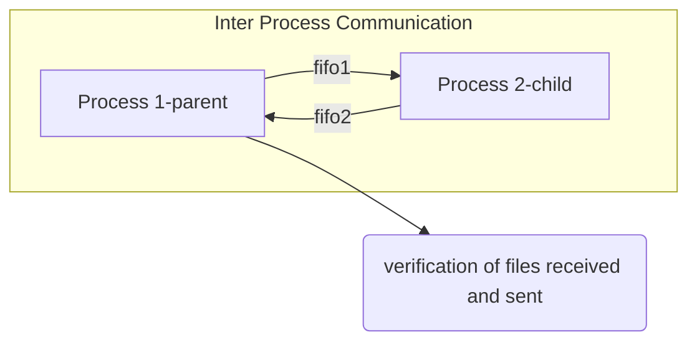

# Operating-System-Lab-03


## Assignment 1

### 1A

- Self explanatory, can be covered by reading the documentation provided in the assignment document.
- the terminal commands are recorded by using the `script {filename}.txt` command, and exited and saved by using `exit`.
- accessed by doing `cat {filename}.txt`.

### 1B
- involves using environment variables using the `getenv()` call.

>What are environment variables?

Environment variables are variables meant to be consistent across all instances of the Linux shell.
Environment variables will be inherited in any copies of the shell that the shell spawns, also known as "exporting" variables, Environment variables can be set system-wide by the system administrator, but it's more common for them to be defined in startup files for individual users.<sup>[1]</sup>

> How do we use `getenv()`?

```c
char* user = getenv("USER");
printf("USER: %s\n", user); // prints username
```

>How can we set an environment variable ourselves?

- By using the `setenv()` system call


```c
   char* newVariableName = "NEW_VARIABLE";  
   char* newVariableValue = "Group 3 Environment Variable";  
   if (setenv(newVariableName, newVariableValue, 1) == 0) // to check if system call was successful    
   {  
       printf("New environment variable set successfully.\n");  
   }    
   else     
   {  
       perror("Error, could not set environment variable, ");  
       return(-1);  
   }
```

```c
int setenv(const char *name, const char *value, int overwrite);
```

- `int overwrite`-  If `name` does exist in the environment, then its value is changed to `value` if `overwrite` is non‐zero;  if `overwrite` is zero, then the value of `name` is not changed.

## Assignment 2

### 2A

> What is `SIGINT` ?

- It's a keyboard interrupt (Ctrl^C) to the shell, with the default action to terminate the process.

> What is `signal()`?

```c
#include <signal.h>
sighandler_t signal(int** signum, sighandler_t** handler);
```
- `signal()` is a system call which sets the system signal `signum` to the `handler`. This `handler`, in our case, is the address of the `signal_handler(int signo)` function defined by us.
- in case the `signal()` call fails, a `SIG_ERR` is returned.

### 2B

- Here, we transfer a 1GB file from one process to another using a FIFO, then back from the 2nd process to the first using another FIFO.

> What is IPC?

 - IPC stands for Inter Process communication- how 2 processes communicate between each other. In our case, we call `fork()` from one program, and the parent-child pair communicate with each other using 2 FIFOs.

> What is a FIFO?

- The FIFO (First In First Out) is general is an abstract data structure (like a queue), that takes data as input in a specific order, and then presents them in the same order in its output.
- In computing, a named pipe/FIFO is one of the methods for inter-process communication.

> Since you mentioned named pipes, do unnamed pipes exist?

 (This really shouldn't arise since the assignment does not deal with unnamed pipes and can probably be ignored, but better to err on the side of caution)

- On all modern systems, the vertical bar `|` represents an unnamed pipe at the command line<sup>[2]</sup>.

```sh

sleep 5 | echo "Hello, world!" ## writer to the left of |, reader to the right
```
 The above example is a little contrived since no data is moved, but control still is. 

>  What is the difference between named and unnamed pipes?

- An unnamed pipe has no backing file: the system maintains an in-memory buffer to transfer bytes from the writer to the reader. Once the writer and reader terminate, the buffer is reclaimed, so the unnamed pipe goes away. 
- By contrast, a named pipe has a backing file and a distinct API.

> How and where are you creating your FIFO?

The FIFOs are created using the `mkfifo()` system call.

```c
int mkfifo(const char *pathname, mode_t mode);
```

- `mkfifo()`  makes a FIFO special file with name `pathname`. `mode` specifies the FIFO's permissions.

```c
char* fifo1 = "/tmp/fifo1";  
char* fifo2 = "/tmp/fifo2";  
```

- `0666` is `rw-rw-rw-` - global read and write permissions to the FIFO files are provided.<sup>[4]</sup>
- the FIFOs are created in the `/tmp` directory- the `tmp` (temporary) directory under root is used to store the data used by the system and user applications to store the data that are needed for a short period of time. Most Linux distributions are preconfigured to empty the `tmp` directory after each reboot.<sup>[3]</sup>

> Explain in short what exactly the code is doing.



- A 1GB file is created in the `/tmp` directory using `fallocate`.
- after the creation of the two FIFOs, `fork()` is used to create the parent and child processes.
- the parent opens `fifo1` in write-only mode, and writes data from the 1GB file to the FIFO using `write()` using a string of size 100 (ideally this should have been a `struct packet` of size 1024- an oversight on our part).
- the child process opens `fifo1` in read only mode and `fifo2` in write only mode, and puts it into an intermediate file (another mistake- it should have passed the packet received onto `fifo2` right away), which is then passed into `fifo2`.
- the parent process then opens `fifo2` in read only and reads the contents of the file received. Once all the contents are received by the parent, it compares the two files for differences.

> How do you measure the amount of time this communication took?

We use `gettimeofday()` with a self written wrapper function `gettimeElapsed()` to get the amount of time taken by the program to execute in milliseconds. 


## Assignment 3

- This assignment is similar to the previous, with the only difference being that sockets are used instead of FIFOs.

> What sockets were used?

- We use stream sockets on the port 8000. (don't say TCP protocol- there is a difference between network sockets and IPC sockets.)
- we check the port and IP used (here, it is the loopback address `127.0.0.1`) using the command:
 ```sh
 ss -a -t
```
- Sockets configured as streams (discussed below) are bidirectional, and control follows a client/server pattern: the client initiates the conversation by trying to connect to a server, which tries to accept the connection.<sup>[2]</sup>

> [!INFO]
> I strongly recommend giving pages 19-21 of reference 2 a good read- it is an excellent resource on IPC communications, and explains sockets very well.

## Assignment 4

- This assignment requires us to use the `mmap()` system call to map out a large fine in the virtual address space, and observe page faults using the `sar` command.
- Our program creates an 8GB file in the `/tmp` directory, and maps it in the virtual address space using `mmap()`- 8GB is more than the available memory in some devices, and isn't necessarily allocated to a single process even when available. 
- Only the pages which are needed as per the paging algorithm used are loaded into memory. In case such a memory address is referenced which isn't on the loaded pages, a **page fault** occurs.
- We reference random addresses from the allocated 8GB file and try to cause page faults, which we observe by running the `sar` command in a seperate terminal

> What are page faults and virtual memory address space?

- This is a theoretical question- study [this](https://www.geeksforgeeks.org/virtual-memory-in-operating-system/) article and [this](https://techcommunity.microsoft.com/t5/ask-the-performance-team/the-basics-of-page-faults/ba-p/373120) article if need be.

> What command is used to observe page faults?

```sh
sar -b 1
```
- `-b` denotes I/O and transfer rate statistics (refer to the man page for details on what statistics are displayed).  `1` denotes the time interval in seconds after which page statistics are shown.

> What is `mmap()` and how is it used?

```c
void *mmap(void *addr, size_t length, int prot, int flags,  
		   int fd, off_t offset);
```

- `mmap()` creates a new mapping in the virtual address space of the calling process.  The starting address for the new mapping is  specified in _addr_.  The _length_ argument specifies the length of the mapping (which must be greater than 0).<sup>[5]</sup>
- The contents of a file mapping  are initialized using _length_ bytes starting at offset _offset_ in the file (or other object) referred to by the file descriptor _fd_.  
- The _prot_ argument describes the desired memory protection of the  mapping (and must not conflict with the open mode of the file). It is either **PROT_NONE** or the bitwise OR of one or more of the following flags:<sup>[5]</sup>
	- **PROT_EXEC**
              Pages may be executed.
	- **PROT_READ**
              Pages may be read.
       - **PROT_WRITE**
              Pages may be written.
       - **PROT_NONE**
              Pages may not be accessed.
- we cast the pointer returned by `mmap` to `char*`

> [!INFO]
> It is recommended to read the `man` page for `mmap`- all parameters used are explained very well there.

## Assignment 5

- The objective of this assignment is to create a deadlock.

- The explanation written in the program header comments, alongside theoretical knowledge on threads and deadlocks should suffice as an explanation of what is happening here.


## Assignment 6

- This assignment involves displaying some specific device, user and operating system information from the `/proc` directory.
-  The files used here are:
	 /proc/cpuinfo
     /proc/sys/kernel/ostype
     /proc/sys/kernel/osrelease
     /proc/version
     /proc/uptime
     /proc/meminfo

- self explanatory- read the code and the output to see what is being displayed.

## Assignment 7

- This assignment revolves around the accessing of shared memory among different threads. 
- Here, we create 3 threads `t1`,`t2`, and `t3`, which access two random quantities `(X,Y)` placed in the shared memory, and performs different operations on them.
- We observe the usage of shared memory by using the `ipcs -m` command.

> How is shared memory accessed and managed in the program?

- We create a shared memory key (in our case, we use `12345`), and then use that shared memory key to access the shared memory segment associated with it by using the `shmget` system call:

```c
int shmget(key_t key, size_t size, int shmflg);
```

- `key` is the key we generated and use, `size` is the amount of space we wish to be allocated (in our case, an integer array of size 7 containing `X,Y` and the 5 values calculated by the threads `A,B,C,D,E`). `shmflg` is the permissions we set for our memory- in our case, its global read and write (`0666`).
- The value returned by this function is our `shmid`- the ID of the shared memory segment we shall be using.

```c
void *shmat(int shmid, const void *shmaddr, int shmflg);
```
- `shmat()`  attaches the shared memory segment identified by `shmid` to the address space of the calling  process.
- If `shmaddr` is NULL, the system chooses a suitable (unused) page-aligned address to attach the segment.
- Since our `shmaddr` is NULL, our `shmflg` or shared memory flag is 0.

```c
int shmdt(const void *shmaddr);
```
 
 - `shmdt()` detaches the shared memory segment located at the address specified by `shmaddr` from the address.

> [!INFO]
> As with `mmap`, I strongly recommend reading the `man` pages for `shmget` and `shmat`- they clarify more on what these system calls do.

> Explain the working of your program in brief.

- The number of iterations is provided as command line input.
- At the start of each iteration, the shared memory segment gets initialised.
- 3 Threads are created, and are started repeatedly in a loop.
- These 3 threads perform different operations (ensuring proper mutual exclusion) on the two shared variables `X,Y`.
- before the start of the next iteration, all variables must finish their execution and wait for each other (we couldn't implement this in our code)
- A single `mutex` is used to ensure mutual exclusion.
- At the last iteration, we show the shared memory using the `ipcs -m` command.

## Sources:

1: https://www.makeuseof.com/environment-variables-in-linux/

2: https://opensource.com/sites/default/files/gated-content/inter-process_communication_in_linux.pdf

3: https://linuxhandbook.com/tmp-directory/

4: https://jameshfisher.com/2017/02/24/what-is-mode_t/ 

5: https://www.man7.org/linux/man-pages/man2/mmap.2.html
